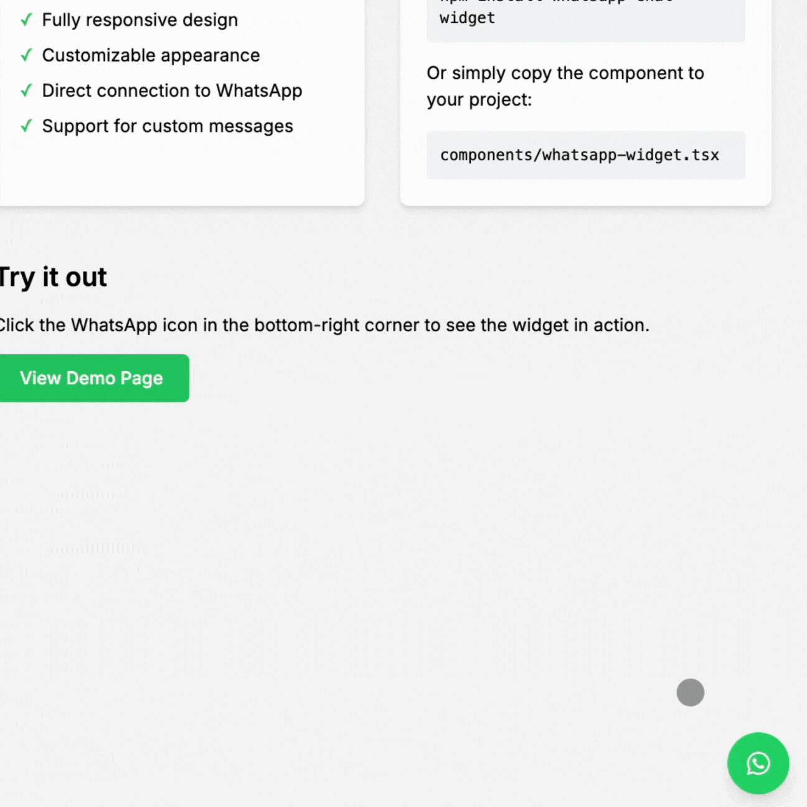

# WhatsApp Chat Widget

A customizable WhatsApp chat widget for websites.



## Installation

```bash
npm install whatsapp-chat-widget
# or
yarn add whatsapp-chat-widget
```

## Usage

```jsx
import { WhatsAppWidget } from "whatsapp-chat-widget";

function App() {
  return (
    <WhatsAppWidget
      phoneNumber="1234567890"
      message="Hello! 👋 How can I help you?"
      companyName="Your Company"
      // Optional props
      buttonColor="#25D366"
      position="right" // 'right' or 'left'
    />
  );
}

export default App;
```

## Props

| Prop        | Type              | Required | Description                                     |
| ----------- | ----------------- | -------- | ----------------------------------------------- |
| phoneNumber | string            | Yes      | WhatsApp number including country code          |
| message     | string            | Yes      | Default message to be sent                      |
| companyName | string            | Yes      | Your company name                               |
| buttonColor | string            | No       | Color of the WhatsApp button (default: #25D366) |
| position    | 'left' \| 'right' | No       | Widget position (default: 'right')              |

## License

AGPLv3.0
