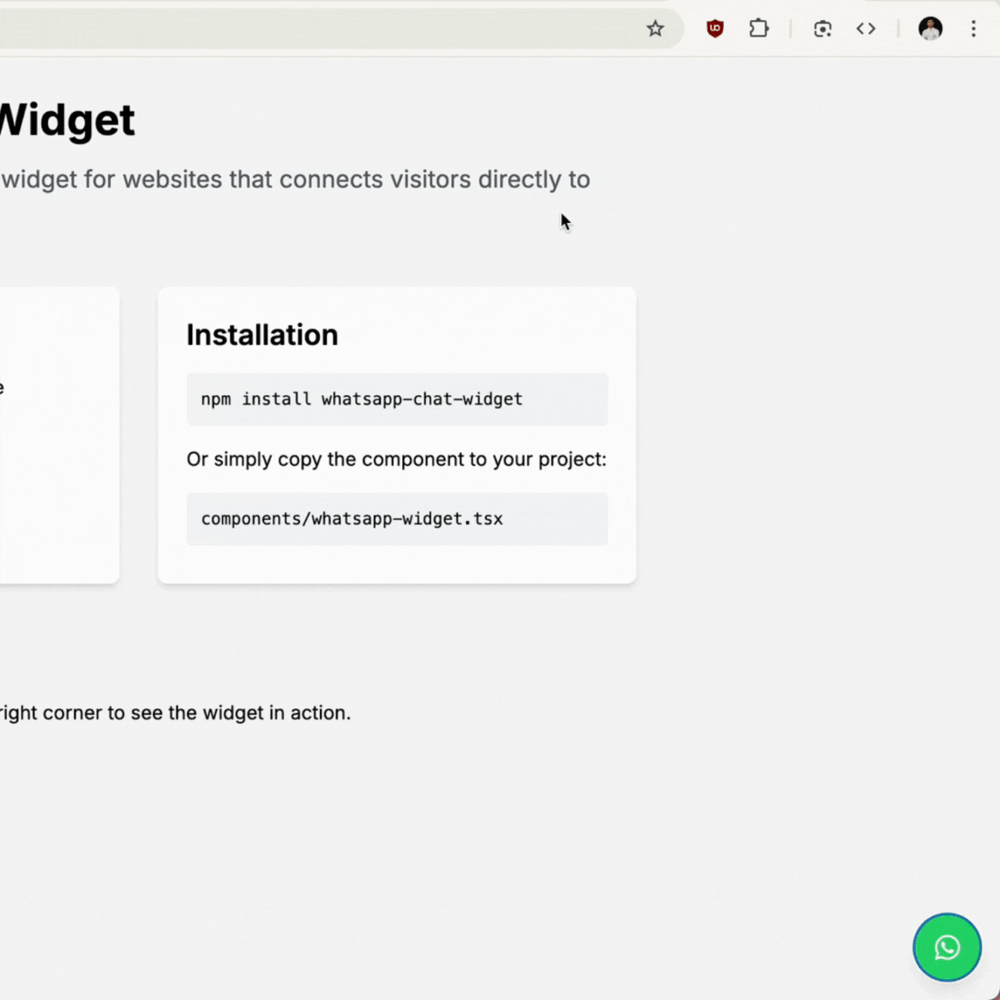

# WhatsApp Chat Widget

A customizable WhatsApp chat widget for websites that mimics the WhatsApp interface and connects visitors directly to your WhatsApp number. Perfect for businesses looking to provide instant customer support.




## ✨ Features

- 💬 Authentic WhatsApp-like interface
- 📱 Fully responsive design (mobile & desktop)
- 🎨 Customizable appearance and messages
- 🔗 Direct connection to WhatsApp
- ⌨️ Support for custom messages
- 🔄 Seamless integration with Next.js and React
- 🌐 Works with web and mobile WhatsApp


## 🚀 Installation

```bash
# Clone the repository
git clone https://github.com/yourusername/whatsapp-chat-widget.git

# Navigate to the project directory
cd whatsapp-chat-widget

# Install dependencies
npm install

# Run the development server
npm run dev
```

## 📋 Usage

### Basic Implementation

Add the WhatsApp widget to any page in your Next.js application:

```jsx
import WhatsAppWidget from "@/components/whatsapp-widget";

export default function HomePage() {
  return (
    <main>
      <h1>Your Website Content</h1>
      
      {/* Add the WhatsApp Widget */}
      <WhatsAppWidget 
        phoneNumber="1234567890" // Include country code
        name="Support Team"
        position="Online | Replies instantly"
        welcomeMessage="Hello! 👋 How can I help you today?"
      />
    </main>
  );
}
```

### Props

| Prop | Type | Default | Description |
|------|------|---------|-------------|
| `phoneNumber` | string | `"1234567890"` | Your WhatsApp number with country code |
| `avatar` | string | `/placeholder.svg` | URL to your profile picture |
| `name` | string | `"Customer Support"` | Name displayed in the chat header |
| `position` | string | `"Typically replies within an hour"` | Status text displayed under the name |
| `welcomeMessage` | string | `"Hello! 👋 How can we help you today?"` | Initial message shown in the chat |
| `placeholder` | string | `"Type a message..."` | Placeholder text for the input field |


## 🎨 Customization

### Styling

The widget uses Tailwind CSS for styling. You can customize the colors by modifying the class names:

```jsx
// Change the header color
<div className="bg-[#YOUR_COLOR_HERE] text-white p-4 flex items-center justify-between">

// Change the button color
<button className="bg-[#YOUR_COLOR_HERE] text-white p-3 sm:p-4 rounded-full">
```

### Behavior

You can customize the message format by modifying the `handleSendMessage` function:

```jsx
const handleSendMessage = () => {
  // Customize your message format here
  const messageToSend = inputText.trim() 
    ? `Custom prefix: ${inputText}` 
    : welcomeMessage;
  
  // Rest of the function...
}
```

## 📱 How It Works

1. The widget displays a floating WhatsApp button on your website
2. When clicked, it opens a chat-like interface
3. Users can type a message or click send with an empty field
4. When the send button is clicked:
   - If the field is empty, it sends your welcome message
   - If the user typed something, it sends "I want to know: [user's message]"
5. The message opens in WhatsApp (web or app) with your number pre-filled


## 📄 License

This project is licensed under the AGPLv3 License - see the [LICENSE](LICENSE) file for details.


## 🤝 Contributing

Contributions are welcome! Please feel free to submit a Pull Request.

1. Fork the repository
2. Create your feature branch (`git checkout -b feature/amazing-feature`)
3. Commit your changes (`git commit -m 'Add some amazing feature'`)
4. Push to the branch (`git push origin feature/amazing-feature`)
5. Open a Pull Request


## 📞 Contact

If you have any questions or feedback, please reach out!

- Shafi Swapnil - [@shafiswapnil](https://www.linkedin.com/in/shafiswapnil/)
- Email - swapnil.env@gmail.com

---

Made with ❤️ by [Shafi Swapnil](https://github.com/shafiswapnil)
